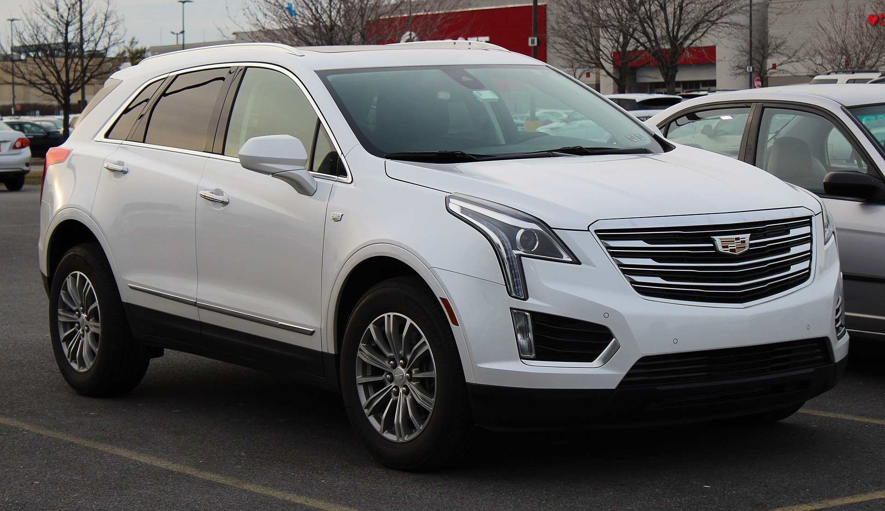
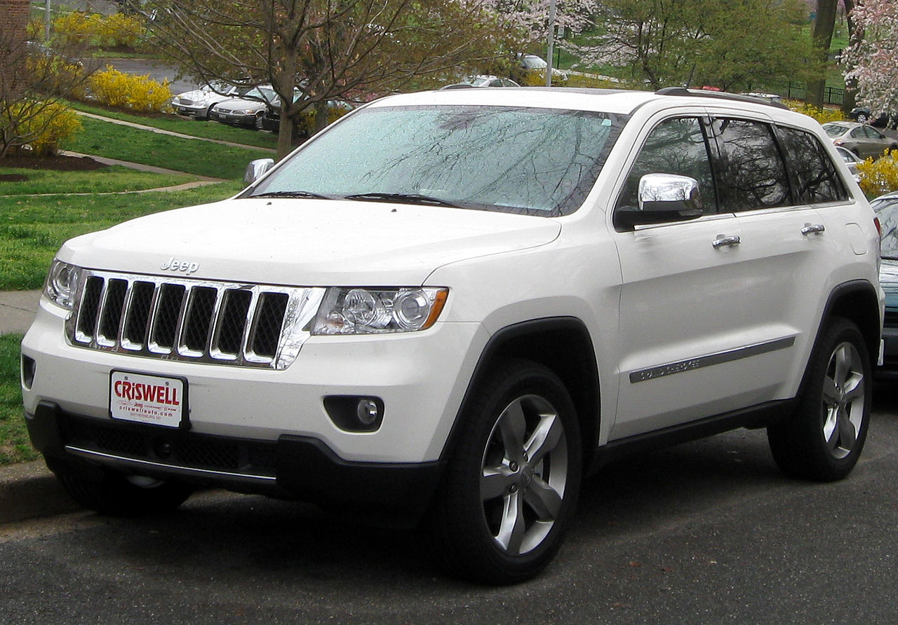
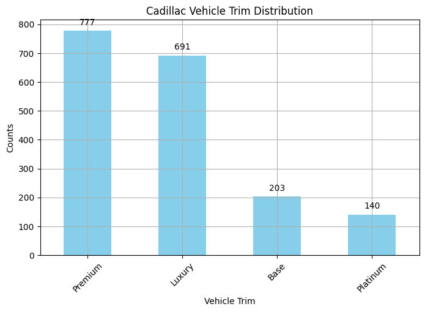
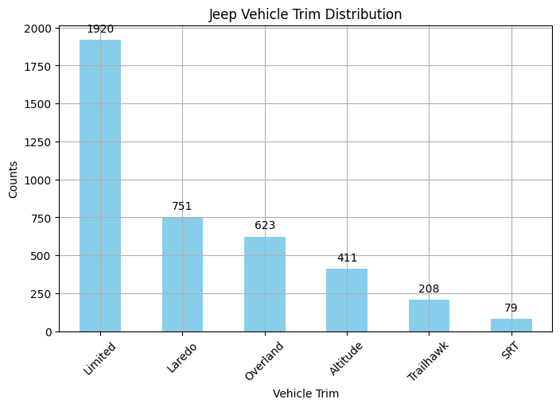
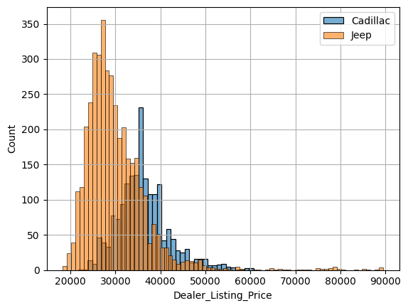
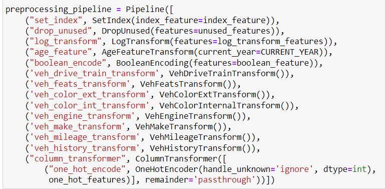
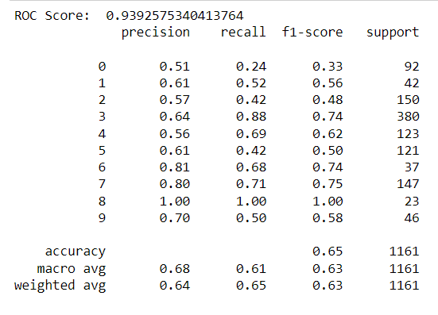
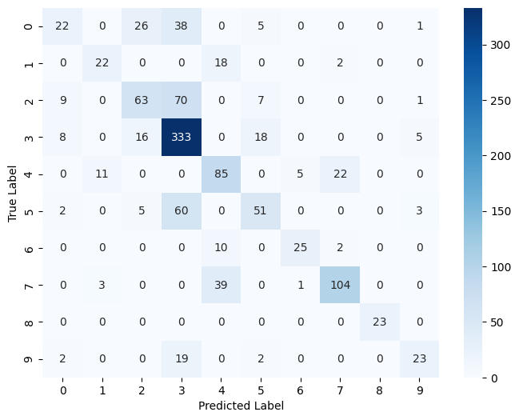

# Problem Statement
The goal is to build one or more models, capable of predicting vehicle trim and dealer listing price given the other twenty-six variables provided.

# Models in the dataset
The dataset set consists of two models of a car:  
- Caddilac XT5 (*left*)
- Jeep Cherokee (*right*)

  
  

## Data Structure
The data consists of `Test_Dataset.csv` and `Training_DataSet.csv`.

The structure of the `Test_Dataset.csv` is as follows:

| Parameter            | Type    | Description                                                                                                      |
|----------------------|---------|------------------------------------------------------------------------------------------------------------------|
| ListingID            | int64   | Unique key that identifies each listing                                                                          |
| SellerCity           | object  | Seller city                                                                                                      |
| SellerIsPriv         | bool    | Boolean that indicates if the listing if from a private seller                                                   |
| SellerListSrc        | object  | Seller listing source identifier                                                                                 |
| SellerName           | object  | Seller name                                                                                                      |
| SellerRating         | float64 | Seller rating (continuous over [0,5] with 5 being a favorable rating)                                             |
| SellerRevCnt         | int64   | Seller review count                                                                                              |
| SellerState          | object  | Seller state                                                                                                     |
| SellerZip            | float64 | Seller zip code                                                                                                  |
| VehCertified         | bool    | Boolean that indicates if the listing has a manufacturer certification (generally indicates extended warranty)   |
| VehColorExt          | object  | Vehicle exterior color                                                                                           |
| VehColorInt          | object  | Vehicle interior color                                                                                           |
| VehDriveTrain        | object  | Vehicle drivetrain (rear/front/all wheel drive)                                                                  |
| VehEngine            | object  | Vehicle engine (generally includes displacement size, whether it is turbocharged, sometimes includes fuel type)  |
| VehFeats             | object  | Vehicle features as listed by the seller in a semi-structured list format                                        |
| VehFuel              | object  | Vehicle fuel type                                                                                                |
| VehHistory           | object  | Vehicle ownership history in a semi-structured format                                                            |
| VehListdays          | float64 | Duration (in days) the vehicle listing has been active                                                           |
| VehMake              | object  | Vehicle make (manufacturer)                                                                                      |
| VehMileage           | float64 | Vehicle mileage                                                                                                  |
| VehModel             | object  | Vehicle model                                                                                                    |
| VehPriceLabel        | object  | A classification label applied by the listing site                                                              |
| VehSellerNotes       | object  | Unstructured text the seller has entered                                                                         |
| VehSellerStockNum    | object  | Vehicle seller stock number                                                                                      |
| VehTransmission      | object  | Vehicle transmission type                                                                                        |
| VehYear              | int64   | Vehicle model year (not necessarily the year it was manufactured)                                                |
| Vehicle_Trim         | object  | Vehicle trim                                                                                                     |
| Dealer_Listing_Price | float64 | Vehicle listing price, dependent variable to be predicted.                                                       |

# Vehicle Trims
Despite having only two models of a car, each of the models comes in variety of trims. In order to facilitate learning, classes with little representation in the dataset were dropped or merged with similar classes. 
Decission on which trim can be merged with which trim, was made based on the literature survey.

  
  

# Price Distribution

  

# Training
Before training the data was heavily prepreocessed using pipeline and appropiate transforms:
- Missing values were imputed
- New features were created
- Categorical features were one-hot-encoded

  

The baseline model without hyperparameter tunning resulted in:

  

  

# Hyperparameter Tunning

